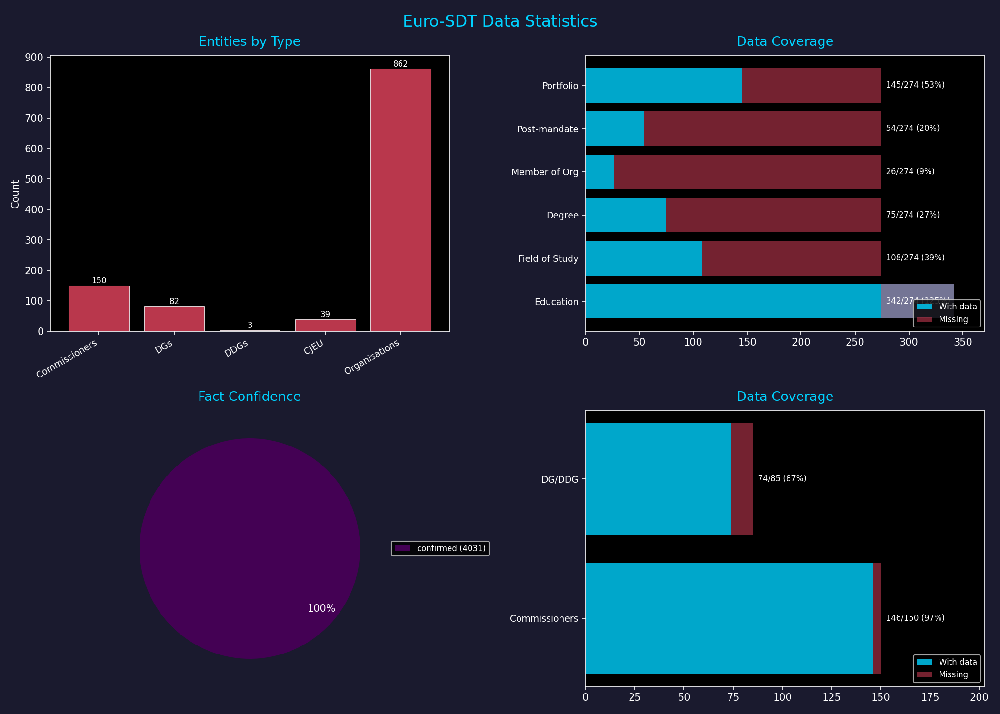
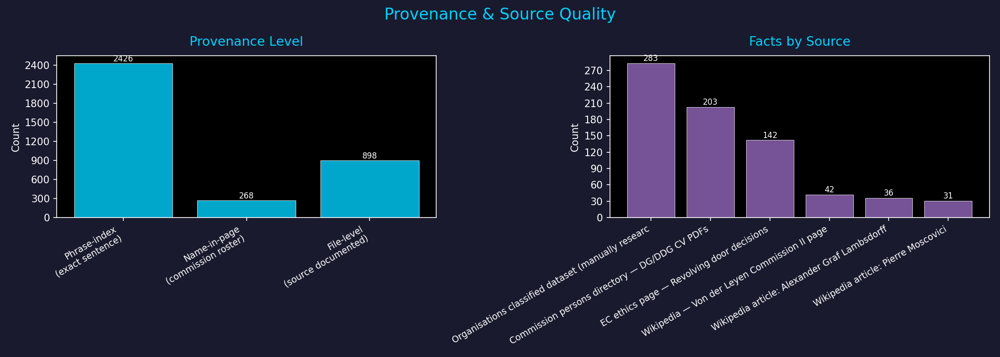
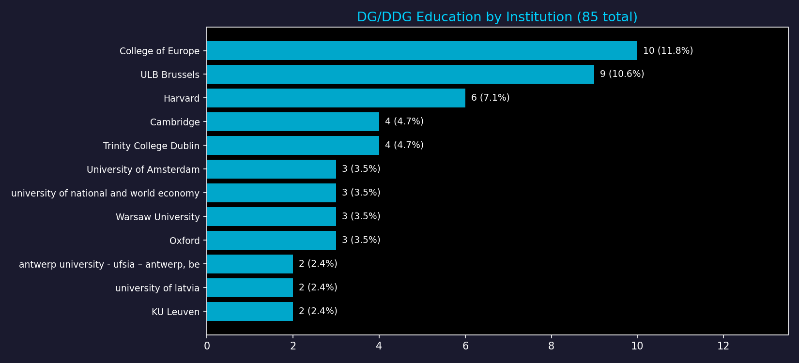
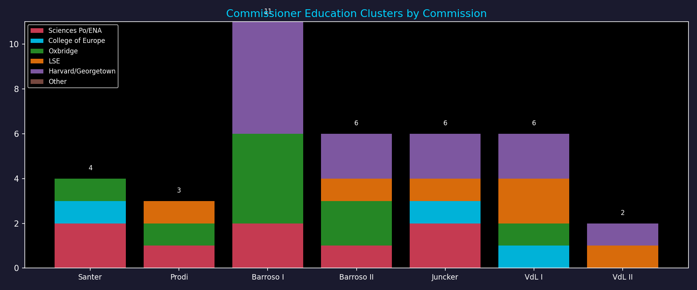
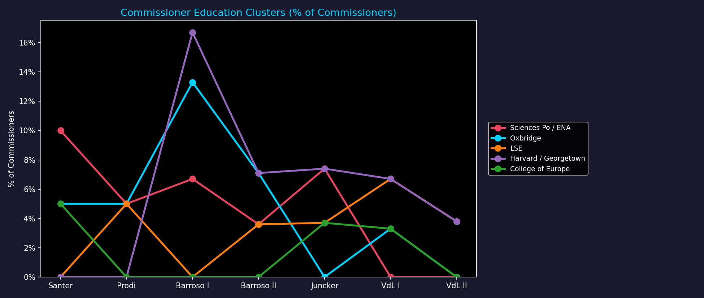
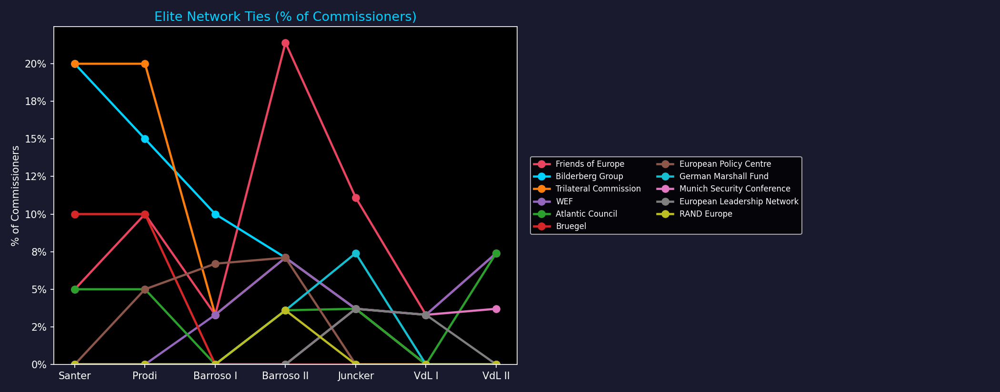
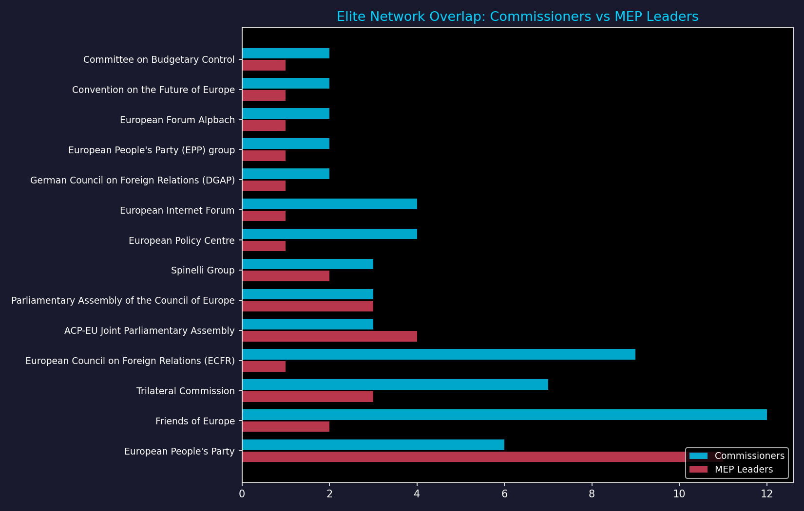
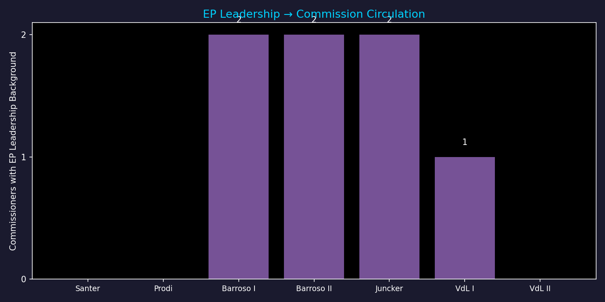

# Data Statistics

← [Back to Wiki](index.md)

## Summary

| Metric | Value |
|---|---|
| Total verified facts | 4031 |
| Entities tracked | 1753 |
| Commissioner education covered | 146/150 |
| DG/DDG education covered | 74/85 |
| Facts with exact source quote | 2426 |
| Confirmed facts | 4031 |

## Entity Overview

## Source Quality

## Data Gaps

| Category | Covered | Total | Gap |
|---|---:|---:|---:|
| Education | 342 | 274 | -68 (-25%) |
| Field of Study | 108 | 274 | 166 (61%) |
| Degree | 75 | 274 | 199 (73%) |
| Member of Org | 26 | 274 | 248 (91%) |
| Post-mandate | 54 | 274 | 220 (80%) |
| Portfolio | 145 | 274 | 129 (47%) |

## DG/DDG Education by Institution

## Commissioner Education Clusters by Commission

## Education Clusters Over Time

## Elite Network Ties

## SDT: Circulation & Overlap

